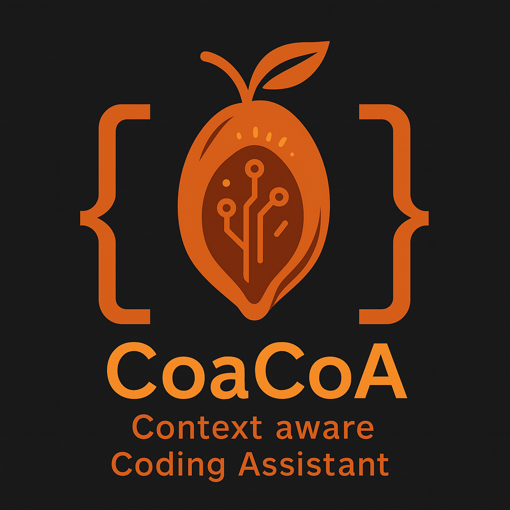

<p align="center">
  
</p>

<p align="center">
  <a href="https://pypi.org/project/coacoa/">
    
  </a>
  <a href="https://github.com/im-shashanks/coacoa/blob/main/LICENSE">
    
  </a>
  <a href="https://github.com/im-shashanks/CoaCoA/actions/workflows/ci.yml">
  
    </a>
  <a href="https://codecov.io/gh/im-shashanks/CoaCoA">
    
  </a>
</p>

<h1 align="center">CoaCoA</h1>
<p align="center"><strong>Context-aware Coding Assistant</strong></p>
<p align="center">
  <em>An enterprise-grade AI-powered development framework that transforms how teams build, test, and ship software</em>
</p>

---

## Overview

CoaCoA is a production-ready framework that integrates AI agents into your development workflow to deliver high-quality, tested code with enterprise-grade compliance. Built for teams who demand reliability, quality, and speed.

### Key Benefits

- **Zero Broken Builds**: Comprehensive quality gates ensure code passes tests, lint, and coverage requirements
- **Enterprise Compliance**: Human-controlled commits with staged changes for audit and review processes
- **Intelligent Automation**: 12 specialized AI agents handle everything from architecture to QA
- **Legacy Integration**: Seamlessly analyze and enhance existing codebases with automated dependency mapping
- **Quality Assurance**: Maintains 90%+ test coverage with anti-hallucination checks

---

## Quick Start

### Installation

```bash
pip install git+https://github.com/im-shashanks/CoaCoA.git
```

> **Note**: CoaCoA is currently in public beta. Installing from git ensures you get the latest features and fixes.

### Initialize Your Project

```bash
# Navigate to your project directory
cd your-project

# Initialize CoaCoA framework
coacoa init --claude-code  # For Claude Code IDE
# or
coacoa init --cline        # For Cline IDE

# Commit the framework setup
git add . && git commit -m "Add CoaCoA framework"
```

### Choose Your Workflow

#### New Projects (Greenfield)
Start with an idea and build a complete application:

```text
/analyst init "Real-time expense tracker for remote teams"
/pm new-prd
/ux-designer make-ui
/architect finalize-arch
/orchestrator run
```

#### Existing Projects (Brownfield)
Enhance existing codebases with unified intelligent analysis:

```text
/codebase-detection        # Single command for comprehensive analysis
/pm new-prd             # Generate PRD based on analysis findings
/architect finalize-arch # Create architecture aligned with existing codebase
/orchestrator run       # Execute implementation workflow
```

---

## 🚀 What's New in v2.0

### **Unified Codebase Analysis** 
- **Single Command**: `/codebase-detection` works seamlessly with both Claude Code and Cline
- **Automatic Mode Detection**: Intelligently detects your IDE and optimizes execution
- **Enterprise-Grade Analysis**: 8-phase comprehensive analysis including security, compliance, and architecture
- **Executive Reporting**: Risk-prioritized findings with actionable recommendations for technical leadership

### **Enhanced Enterprise Support**
- **Massive Codebase Handling**: Supports 100K+ file repositories with intelligent token management
- **Security & Compliance**: Built-in CVE scanning, license validation, and enterprise security patterns
- **Advanced Build Systems**: Support for Bazel, Buck, Rush, Nx, and other enterprise build tools
- **Evidence-Based Analysis**: No hallucinated findings - all claims supported by actual code analysis

### **Improved Workflow Management**
- **Planning-First Approach**: Front-loads all intelligence into comprehensive, self-contained plans
- **Tool-Optimized Execution**: Parallel processing (Claude Code) vs sequential user-controlled (Cline)
- **Progress Tracking**: Real-time visibility into analysis progress with standardized status updates
- **Quality Assurance**: Enhanced validation with JSON schema checking and cross-phase validation

---

## Architecture

### Multi-Agent System

CoaCoA employs 12 specialized AI agents, each with distinct responsibilities:

| Agent | Role | Purpose |
|-------|------|---------|
| **Analyst** | Requirements Gathering | Converts ideas into detailed domain specifications |
| **Product Manager** | Strategy & Planning | Creates PRDs and defines feature requirements |
| **UX Designer** | User Experience | Designs interfaces and accessibility guidelines |
| **Product Owner** | Backlog Management | Prioritizes features and manages epic dependencies |
| **Architect** | System Design | Creates technical architecture and design decisions |
| **Scrum Master** | Project Management | Breaks epics into implementable stories |
| **Developer** | Implementation | Writes code following TDD practices with >90% coverage |
| **QA Engineer** | Quality Assurance | Validates implementations against requirements |
| **Code Explorer** | Codebase Analysis | Unified enterprise-grade codebase analysis with security, architecture, and quality assessment |
| **Orchestrator** | Workflow Management | Coordinates multi-agent workflows and ensures quality gates |

### Quality Framework

CoaCoA implements five comprehensive quality gates:

1. **Build Integrity**: Ensures all code compiles, tests pass, and linting requirements are met
2. **Anti-Hallucination**: Validates symbol names, paths, and API references for accuracy
3. **Architecture Integrity**: Prevents dependency cycles and enforces design principles
4. **Link Integrity**: Verifies all file references and documentation links
5. **QA Compliance**: Confirms requirements are met and edge cases are handled

---

## Project Structure

After initialization, CoaCoA creates the following structure:

```
your-project/
├── coacoa/                          # CoaCoA framework (add to .gitignore)
│   ├── coacoa.yaml                  # Configuration settings
│   ├── agents/                      # AI agent specifications
│   ├── tasks/                       # Unified workflow tasks
│   ├── templates/                   # Document and analysis templates
│   ├── schemas/                     # JSON validation schemas
│   ├── quality/                     # Quality gate checklists
│   ├── workflows/                   # Greenfield and brownfield workflows
│   └── context/                     # Generated analysis and intelligence
│       └── analysis/                # Unified analysis structure
│           ├── plan.md              # Master analysis plan with progress
│           ├── artifacts/           # JSON intelligence files
│           ├── reports/             # Detailed phase reports
│           └── consolidated/        # Executive summary & recommendations
├── CLAUDE.md                        # Claude Code command reference
├── .clinerules/                     # Cline IDE integration
└── coacoa.yaml                      # Project-specific overrides (optional)
```

---

## Configuration

### Default Configuration

CoaCoA uses a hierarchical configuration system:

- **Base configuration**: `coacoa/coacoa.yaml` (framework defaults)
- **Project overrides**: `coacoa.yaml` in your project root (optional)

### Key Configuration Options

```yaml
# Unified Analysis Structure
paths:
  analysis_dir: coacoa/context/analysis/               # Main analysis directory
  analysis_plan: coacoa/context/analysis/plan.md      # Master analysis plan
  analysis_artifacts: coacoa/context/analysis/artifacts/ # JSON intelligence files
  analysis_consolidated: coacoa/context/analysis/consolidated/ # Final outputs

# Resource Management
limits:
  max_snippet_loc: 120               # Lines of code per context window
  max_tokens_context: 12000          # Token budget for AI operations

# Unified Analysis Configuration
analysis:
  enterprise_mode: true              # Enable enterprise-specific features
  unified_workflow: true             # Use new unified analysis workflow
  auto_mode_detection: true          # Automatically detect Claude Code vs Cline
  schema_validation: true            # Validate all artifacts against schemas
  evidence_requirement: true         # Require evidence-based findings only
  parallel_task_limit: 8             # Max parallel tasks for Claude Code mode

# Quality Assurance
quality:
  anti_hallucination: coacoa/quality/anti_hallucination.md
  build_integrity: coacoa/quality/build_integrity.md
  security_gate: coacoa/quality/security_gate.md
  performance_gate: coacoa/quality/performance_gate.md
```

---

## Command Reference

### Prerequisites

Before using commands, ensure CoaCoA is properly initialized in your project:

```bash
# Initialize for your IDE
coacoa init --claude-code    # For Claude Code users
coacoa init --cline         # For Cline users

# Commit the framework setup
git add . && git commit -m "Add CoaCoA framework"
```

### Understanding Command Structure

All CoaCoA commands follow a strict instruction format designed to ensure AI agents follow exact specifications without deviation. Each command:

- **Enforces strict adherence** to agent instructions with ALL CAPS warnings
- **References exact agent specification files** with explicit paths
- **Prevents AI deviation** through emphatic instruction formatting
- **Works identically** across Claude Code and Cline IDEs

#### Recent Enhancement: Command Instruction Enforcement

**New in v2.0**: All command files now include emphatic instruction formatting to ensure Claude Code follows rules exactly:

```markdown
# THIS COMMAND IS FOR [SPECIFIC PURPOSE]. YOU MUST FOLLOW INSTRUCTIONS EXACTLY AS GIVEN. DO NOT DEVIATE FROM THE PROCESS.

## INSTRUCTION
As a [agent-name] agent you **MUST** follow the instructions **EXACTLY** as in **Path:** `coacoa/agents/[agent_file].md`
```

This format ensures:
- **No deviation** from specified agent behavior
- **Exact path references** to agent specification files
- **Consistent execution** across different AI environments
- **Predictable results** regardless of IDE or AI model variations

### IDE Integration Commands

CoaCoA provides specialized slash commands for seamless AI-powered development:

| Command | Agent | Purpose | Best Use Case | Parameters |
|---------|--------|---------|---------------|------------|
| `/codebase-detection` | **Code Explorer** | **Enterprise codebase analysis** | **Brownfield projects - comprehensive analysis** | None - automatically detects IDE mode |
| `/analyst init "<idea>"` | **Analyst** | Requirements gathering from idea | **Greenfield - start new projects** | `<idea>` - one-line vision statement |
| `/analyst` | **Analyst** | Domain analysis for existing code | **Brownfield - understand domain** | None |
| `/pm new-prd` | **Product Manager** | Generate product requirements | **After analyst phase - define scope** | None |
| `/ux-designer make-ui` | **UX Designer** | Create interface specifications | **UI/UX planning phase** | None |
| `/po refine-epics` | **Product Owner** | Prioritize and refine features | **Backlog management** | None |
| `/architect finalize-arch` | **Architect** | System architecture design | **Technical planning phase** | None |
| `/scrum-master create` | **Scrum Master** | Break epics into stories | **Sprint planning** | None |
| `/dev implement <story>` | **Developer** | Code implementation | **Development phase** | `<story>` - story ID like `s_001_01` |
| `/qa review` | **QA Engineer** | Quality validation | **Testing phase** | None |
| `/orchestrator run` | **Orchestrator** | Automated end-to-end workflow | **Full pipeline execution** | None |
| `/orchestrator log` | **Orchestrator** | View workflow progress | **Monitor execution status** | None |
| `/orchestrator fix` | **Orchestrator** | Repair workflow issues | **Fix broken workflows** | None |

### Command Execution Modes

#### Claude Code Mode (Parallel Processing)
- **Automatic Detection**: Commands detect Claude Code environment
- **Parallel Execution**: Multiple analysis phases run simultaneously
- **Faster Performance**: Optimized for Claude Code's parallel processing capabilities
- **Auto-Orchestration**: Automatic coordination between agents

#### Cline Mode (Sequential User-Controlled)
- **Sequential Steps**: User controls progression through each phase
- **Manual Control**: User approves each step before proceeding
- **Resume Capability**: Can pause and resume analysis at any phase
- **User Oversight**: Maximum human control over the process

### Workflow Patterns

#### 🌱 Greenfield Development (New Projects)

**Complete new project workflow:**
```text
1. /analyst init "Real-time expense tracker for remote teams"
2. /pm new-prd
3. /ux-designer make-ui  
4. /po refine-epics
5. /architect finalize-arch
6. /scrum-master create
7. /orchestrator run
```

**What each step does:**
- **Analyst**: Captures problem domain, user personas, and business requirements
- **PM**: Creates comprehensive Product Requirements Document (PRD)
- **UX Designer**: Designs user interface and accessibility specifications
- **Product Owner**: Prioritizes features and manages epic dependencies
- **Architect**: Creates technical architecture with decision records
- **Scrum Master**: Breaks epics into implementable user stories
- **Orchestrator**: Manages development workflow with quality gates

#### 🏗️ Brownfield Enhancement (Existing Projects)

**Enhanced analysis workflow:**
```text
1. /codebase-detection     # Single comprehensive analysis command
2. /analyst                # Understand domain from existing code
3. /pm new-prd            # Generate PRD based on analysis findings  
4. /architect finalize-arch # Architecture aligned with existing codebase
5. /orchestrator run      # Execute implementation workflow
```

**What the unified analysis provides:**
- **Repository Intelligence**: Complete codebase structure and patterns
- **Architecture Assessment**: Dependency mapping and design patterns
- **Quality Analysis**: Technical debt and maintainability metrics
- **Security & Compliance**: Vulnerability scanning and license validation
- **Performance Assessment**: Algorithmic complexity and scalability analysis
- **Team Collaboration**: Git history analysis and knowledge risk assessment
- **Executive Summary**: Risk-prioritized findings with actionable recommendations

### Advanced Usage Patterns

#### Story-Specific Development
```text
# Implement specific user story
/dev implement s_001_02

# Review specific implementation
/qa review s_001_02
```

#### Workflow Monitoring
```text
# Check orchestrator progress
/orchestrator log

# Fix issues in workflow
/orchestrator fix

# Run full pipeline
/orchestrator run
```

#### Analysis Refresh
```text
# Re-analyze codebase after major changes
/codebase-detection

# Update architecture after refactoring
/architect finalize-arch
```

### Error Handling & Recovery

**Common Issues and Solutions:**

1. **"Framework files not detected"**
   - **Solution**: Run `coacoa init --claude-code` or `coacoa init --cline`
   - **Cause**: CoaCoA not properly initialized

2. **"Dependencies not resolved"**
   - **Solution**: Check `orchestrator_log.md` for dependency chain
   - **Cause**: Story dependencies not completed in order

3. **"Quality gates failed"**
   - **Solution**: Run `/orchestrator fix` to identify and resolve issues
   - **Cause**: Code doesn't meet quality standards (tests, lint, coverage)

4. **"SHA unchanged - skipping analysis"**
   - **Solution**: This is normal - analysis is cached until code changes
   - **Cause**: Codebase hasn't changed since last analysis

### CLI Commands

```bash
# Get help
coacoa --help
coacoa init --help

# Initialize with IDE support
coacoa init --claude-code    # For Claude Code users
coacoa init --cline         # For Cline users  

# Check version and status
coacoa version
```

### Configuration Customization

Commands respect your project configuration in `coacoa.yaml`:

```yaml
# Customize analysis behavior
analysis:
  enterprise_mode: true              # Enable enterprise features
  auto_mode_detection: true          # Auto-detect Claude Code vs Cline
  parallel_task_limit: 8             # Max parallel tasks (Claude Code)
  
# Customize quality gates
quality:
  coverage_threshold: 90             # Minimum test coverage
  complexity_threshold: 10           # Maximum cyclomatic complexity
  
# Customize agent behavior  
agents:
  dev:
    tdd_mode: true                   # Test-driven development
    coverage_enforcement: strict     # Strict coverage requirements
```

---

## Workflows

### Greenfield Development

Build new applications from concept to production:

1. **Requirements Analysis**: Gather and refine requirements through AI-guided questioning
2. **Product Planning**: Generate comprehensive PRDs with measurable goals
3. **UX Design**: Create user interface specifications and accessibility guidelines
4. **Architecture Design**: Design system architecture with decision records
5. **Implementation**: Develop features with test-driven development
6. **Quality Assurance**: Validate implementations against requirements
7. **Deployment**: Stage changes for human review and approval

### Unified Codebase Analysis

**NEW**: Single-command enterprise-grade codebase analysis for both Claude Code and Cline:

#### **Analysis Phases** (Automatic execution mode detection):

1. **Repository Intelligence**: File discovery, language detection, architecture pattern recognition
2. **Build System Analysis**: Enterprise build system detection (Bazel, Rush, Nx, standard tools)
3. **Architecture Assessment**: Dependency mapping, circular dependency detection, layer violations
4. **Quality & Complexity**: Code complexity metrics, technical debt assessment, maintainability analysis
5. **Security & Compliance**: Vulnerability scanning, license compliance, enterprise security patterns
6. **Git History Analysis**: Team collaboration patterns, knowledge risks, code hotspot identification
7. **Performance Assessment**: Algorithmic complexity analysis, scalability bottlenecks
8. **Executive Summary**: Risk-prioritized findings with actionable recommendations

#### **Execution Modes**:
- **Claude Code**: Parallel execution with automatic orchestration
- **Cline**: Sequential execution with user-controlled progression

#### **Enterprise Features**:
- **Evidence-Based Analysis**: No hallucinated findings, all claims supported by code analysis
- **Schema Validation**: All artifacts validated against defined schemas  
- **Progress Tracking**: Real-time visibility into analysis progress
- **Partial Results**: Graceful degradation if analysis cannot complete fully
- **Quality Gates**: Built-in anti-hallucination and validation checks

---

## Enterprise Features

### Compliance & Governance

- **Human-Controlled Commits**: All changes are staged but never automatically committed
- **Audit Trail**: Complete history of decisions through Architecture Decision Records (ADRs)
- **Quality Enforcement**: Mandatory quality gates prevent substandard code from progressing
- **Dependency Management**: Automated analysis and management of project dependencies

### Scalability & Performance

- **Token-Aware Processing**: Language-specific token estimation with intelligent chunking
- **Dual Execution Modes**: Parallel processing (Claude Code) or sequential with resume capability (Cline)
- **Enterprise-Scale Ready**: Handles 100K+ file codebases with progressive summarization
- **Smart Batch Sizing**: Directory affinity and complexity-based file grouping
- **Fingerprint-Based Caching**: Only reanalyzes changed components

### Integration Capabilities

- **Multi-IDE Support**: Claude Code and Cline integration out of the box
- **Version Control**: Git-native workflow with branch-per-feature development
- **Advanced Build System Detection**: Enterprise systems (Bazel, Buck, Rush, Nx) + standard tools (Maven, Gradle, NPM, Python)
- **Security & Compliance Integration**: CVE scanning, license validation, enterprise security patterns
- **Testing Framework Integration**: Seamless integration with existing test suites

---

## FAQ

**Q: Why doesn't CoaCoA auto-commit changes?**
A: Enterprise compliance often requires human review and sign-off. CoaCoA stages all changes but leaves final commits to developers, ensuring proper audit trails and approval processes.

**Q: How does CoaCoA handle massive enterprise codebases?**
A: The new unified analysis workflow uses language-specific token estimation, intelligent batch sizing, and progressive summarization. It can handle 100K+ file codebases by focusing on highest-impact insights within configurable token limits.

**Q: Can I customize the quality requirements?**
A: Yes, all quality gates are configurable through the `coacoa.yaml` file. You can adjust coverage thresholds, add custom checklists, and modify workflow steps to match your team's standards.

**Q: Is CoaCoA suitable for large enterprises?**
A: CoaCoA is designed with enterprise requirements in mind, including human oversight, comprehensive auditing, quality enforcement, and compliance features required by large organizations.

**Q: What's new in the unified codebase analysis?**
A: The new `/codebase-detection` command provides enterprise-grade analysis through a single interface that automatically detects your IDE (Claude Code vs Cline) and optimizes execution accordingly. It includes security scanning, compliance checks, and generates executive-ready reports with actionable recommendations.

**Q: How does CoaCoA handle existing code standards?**
A: The unified analysis automatically detects existing patterns, conventions, and architectural decisions, then ensures all new code follows established practices while providing specific improvement recommendations prioritized by risk level.

**Q: Why do all commands have such emphatic formatting with ALL CAPS warnings?**
A: The recent v2.0 enhancement addresses AI consistency issues. The emphatic formatting with ALL CAPS warnings ensures that Claude Code and other AI systems follow the exact agent specifications without deviation. This prevents AI systems from improvising or taking shortcuts that could compromise code quality or workflow integrity.

**Q: Do I need to update my existing CoaCoA installation to get the new command structure?**
A: Yes, run `pip install git+https://github.com/im-shashanks/CoaCoA.git` to get the latest version with enhanced command instruction enforcement. Then run `coacoa init --claude-code` or `coacoa init --cline` in your project to update the command files.

**Q: What's the difference between Claude Code and Cline execution modes?**
A: Claude Code mode enables parallel processing where multiple analysis phases run simultaneously with automatic orchestration. Cline mode provides sequential user-controlled execution where you approve each step, offering maximum human oversight. Both modes produce identical results but with different interaction patterns.

---

## Contributing

We welcome contributions from the community. To get started:

1. **Fork** the repository and create a feature branch
2. **Test** your changes using `/orchestrator run` on sample projects  
3. **Ensure** all quality gates pass before submitting
4. **Submit** a pull request with appropriate documentation

For major architectural changes, please create an Architecture Decision Record (ADR) as part of your submission.

---

## License

CoaCoA is licensed under the Apache-2.0 License. See [LICENSE](LICENSE) for details.

---

## Support

- **Documentation**: [CoaCoA Docs](https://docs.anthropic.com/en/docs/claude-code/)
- **Issues**: [GitHub Issues](https://github.com/im-shashanks/CoaCoA/issues)
- **Discussions**: [GitHub Discussions](https://github.com/im-shashanks/CoaCoA/discussions)

---

<p align="center">
  <strong>Ready to transform your development workflow?</strong><br>
  <code>pip install git+https://github.com/im-shashanks/CoaCoA.git && coacoa init</code>
</p>