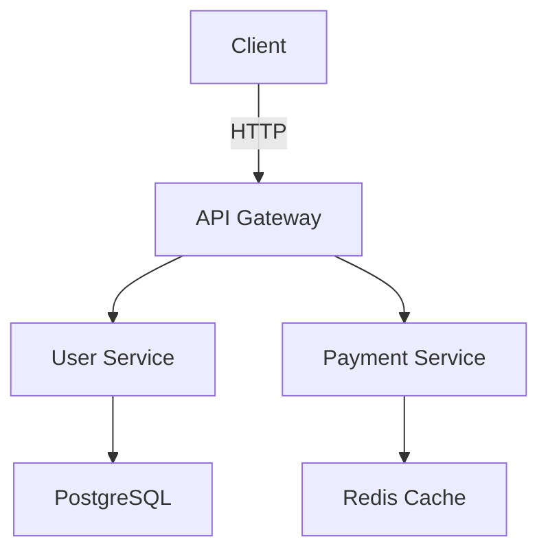

# Documentation Style Guide

## README.md Structure

Every project should have a comprehensive README following this template:

```markdown
# Project Name

Brief description of what the project does and who it's for.

## Features

- Feature 1: Brief description
- Feature 2: Brief description  
- Feature 3: Brief description

## Quick Start

### Prerequisites
- Requirement 1 (version)
- Requirement 2 (version)

### Installation
```bash
# Step 1
command here

# Step 2  
command here
```

### Basic Usage
```language
// Simple example showing core functionality
code example
```

## Documentation

- [API Documentation](docs/api.md)
- [Contributing Guide](CONTRIBUTING.md)
- [Changelog](CHANGELOG.md)

## License

[MIT](LICENSE) © [Your Name](https://github.com/yourusername)
```

## API Documentation

### Function Documentation
```typescript
/**
 * Calculates the total price including tax and discounts.
 * 
 * @param basePrice - The original price before any modifications
 * @param taxRate - Tax rate as decimal (0.08 for 8%)
 * @param discountPercent - Discount percentage (10 for 10% off)
 * @returns The final price after tax and discount
 * 
 * @example
 * ```typescript
 * const total = calculateTotal(100, 0.08, 10);
 * console.log(total); // 97.20
 * ```
 * 
 * @throws {ValidationError} When basePrice is negative
 * @throws {ValidationError} When taxRate is negative or > 1
 */
function calculateTotal(
  basePrice: number,
  taxRate: number,
  discountPercent: number
): number {
  // Implementation
}
```

### Class Documentation
```typescript
/**
 * Manages user authentication and session handling.
 * 
 * Provides methods for login, logout, and session validation.
 * Automatically handles token refresh and storage.
 * 
 * @example
 * ```typescript
 * const auth = new AuthManager({
 *   apiUrl: 'https://api.example.com',
 *   storage: window.localStorage
 * });
 * 
 * await auth.login('user@example.com', 'password');
 * const isLoggedIn = auth.isAuthenticated();
 * ```
 */
class AuthManager {
  /**
   * Creates a new AuthManager instance.
   * 
   * @param config - Configuration options
   * @param config.apiUrl - Base URL for authentication API
   * @param config.storage - Storage implementation for tokens
   */
  constructor(config: AuthConfig) {
    // Implementation
  }
}
```

## Markdown Standards

### Headers
```markdown
# H1 - Document Title (only one per document)

## H2 - Major Sections

### H3 - Subsections

#### H4 - Details (avoid deeper nesting)
```

### Code Blocks
```markdown
# Always specify language for syntax highlighting
```typescript
const example = "code here";
```

# Use generic "text" for shell output
```text
Output: result here
```

# Use "bash" for shell commands
```bash
npm install
cd project-directory
```
```

### Lists and Tables
```markdown
# Unordered lists
- Item 1
  - Sub-item 1.1
  - Sub-item 1.2
- Item 2

# Ordered lists
1. First step
2. Second step
   1. Sub-step 2.1
   2. Sub-step 2.2

# Tables
| Column 1 | Column 2 | Column 3 |
|----------|----------|----------|
| Value 1  | Value 2  | Value 3  |
| Value 4  | Value 5  | Value 6  |
```

### Links and References
```markdown
# External links
[Link Text](https://example.com)

# Internal links
[Section Reference](#section-name)

# Reference-style links
[Link Text][ref-id]

[ref-id]: https://example.com "Optional title"
```

## Comment Standards

### Inline Comments
```python
# Explain WHY, not WHAT
user_count = len(users)  # Cache count to avoid repeated calculations

# Explain complex business logic
if user.subscription_tier == 'premium' and user.trial_days_remaining <= 0:
    # Premium users lose access immediately after trial
    revoke_access(user)
elif user.subscription_tier == 'basic' and user.usage > BASIC_LIMIT:
    # Basic users get grace period before restriction
    schedule_usage_warning(user)
```

### TODO Comments
```typescript
// TODO(username, 2024-01-15): Add input validation
// FIXME(username): Handle edge case when user is null
// HACK: Temporary workaround until API v2 is available
// NOTE: This behavior is required by the payment processor
```

## Architecture Documentation

### ADR (Architecture Decision Record) Format
```markdown
# ADR-001: Use PostgreSQL for Primary Database

## Status
Accepted

## Context
We need to choose a database system for our user management system.
Requirements include:
- ACID transactions
- Complex queries with joins
- JSON data support
- Strong consistency

## Decision
We will use PostgreSQL as our primary database.

## Consequences
### Positive
- Strong ACID guarantees
- Excellent JSON support
- Mature ecosystem
- Great performance for complex queries

### Negative  
- More complex setup than NoSQL alternatives
- Requires database administration knowledge
- Vertical scaling limitations

## Alternatives Considered
- MongoDB: Lacks ACID transactions across collections
- MySQL: Weaker JSON support
- SQLite: Not suitable for concurrent access
```

### System Architecture Documentation
```markdown
# System Architecture

## Overview
Brief description of the system and its purpose.

## Components

### Component 1: User Service
- **Purpose**: Manages user authentication and profiles
- **Technology**: Node.js, Express, PostgreSQL
- **Interfaces**: REST API, GraphQL subscriptions
- **Dependencies**: Authentication Service, Email Service

### Component 2: Payment Service  
- **Purpose**: Handles billing and payment processing
- **Technology**: Python, FastAPI, Redis
- **Interfaces**: REST API, Webhooks
- **Dependencies**: External payment processors

## Data Flow


## Security Considerations
- Authentication: JWT with refresh tokens
- Authorization: Role-based access control (RBAC)
- Data encryption: TLS 1.3 in transit, AES-256 at rest
- Input validation: All inputs validated and sanitized
```

## Error Documentation

### Error Response Format
```json
{
  "error": {
    "code": "VALIDATION_ERROR",
    "message": "The provided email address is invalid",
    "details": {
      "field": "email",
      "value": "invalid-email",
      "constraint": "Must be a valid email address"
    },
    "timestamp": "2024-01-15T10:30:00Z",
    "requestId": "req_12345"
  }
}
```

### Error Code Documentation
```markdown
## Error Codes

### Authentication Errors (AUTH_*)
- `AUTH_INVALID_TOKEN`: The provided authentication token is invalid or expired
- `AUTH_INSUFFICIENT_PERMISSIONS`: User lacks required permissions for this action
- `AUTH_ACCOUNT_LOCKED`: User account has been temporarily locked

### Validation Errors (VALIDATION_*)
- `VALIDATION_REQUIRED_FIELD`: A required field was not provided
- `VALIDATION_INVALID_FORMAT`: Field value doesn't match expected format
- `VALIDATION_VALUE_TOO_LONG`: Field value exceeds maximum length
```

## Changelog Standards

```markdown
# Changelog

All notable changes to this project will be documented in this file.
The format is based on [Keep a Changelog](https://keepachangelog.com/).

## [Unreleased]
### Added
- New feature descriptions

### Changed
- Changes to existing functionality

### Deprecated
- Features that will be removed

### Removed
- Removed features

### Fixed
- Bug fixes

### Security
- Security improvements

## [1.2.0] - 2024-01-15
### Added
- User profile management endpoints
- Email verification workflow

### Changed
- Updated authentication token expiry from 1h to 4h
- Improved error messages for validation failures

### Fixed
- Fixed race condition in user creation
- Resolved memory leak in background job processor
```